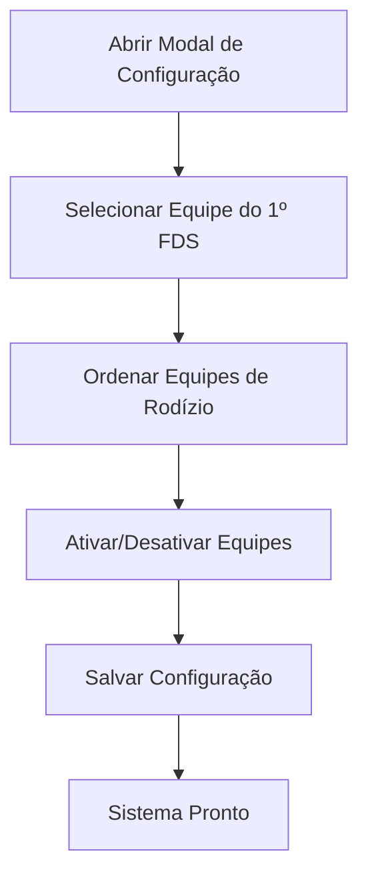
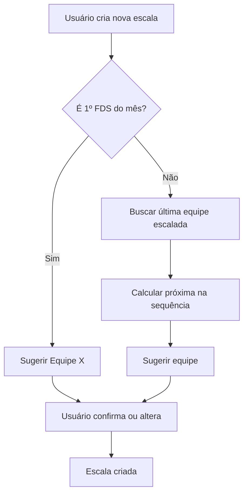
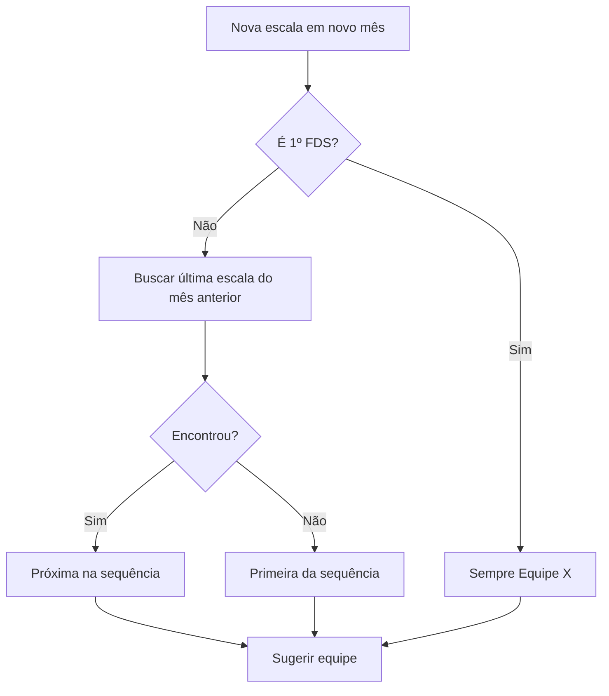

# 🔄 Sistema de Rodízio Automático de Equipes

## 📋 RESUMO

Sistema completo para gerenciar o rodízio automático de equipes fixas, respeitando regras de negócio e histórico de escalas.

---

## 🎯 REGRAS DE NEGÓCIO

### 1. Equipe do 1º Final de Semana

- **Equipe X** sempre escala no **primeiro final de semana** do mês
- Dias 1 a 7 do mês = 1º final de semana
- Esta equipe não entra no rodízio normal

### 2. Sequência de Rodízio

**Ordem padrão**: A1 → B1 → C1 → A2 → B2 → C2 (repetindo)

- Escalas nos demais finais de semana seguem esta sequência
- Sequência é **configurável** via interface
- Equipes podem ser **ativadas/desativadas**

### 3. Continuidade Entre Meses

**Exemplo:**

```
Maio 2026:
- 03/05 (1º FDS) → Equipe X
- 10/05 (2º FDS) → Equipe A1
- 17/05 (3º FDS) → Equipe B1
- 24/05 (4º FDS) → Equipe C1
- 31/05 (5º FDS) → Equipe A2

Junho 2026:
- 07/06 (1º FDS) → Equipe X  (sempre no 1º)
- 14/06 (2º FDS) → Equipe B2  (continua de onde parou)
- 21/06 (3º FDS) → Equipe C2
- 28/06 (4º FDS) → Equipe A1  (volta ao início)
```

---

## 🗄️ ESTRUTURA DO BANCO

### Tabela: `worship_fixed_teams`

**Novas colunas:**

```sql
order_index INTEGER DEFAULT 0
  -- Ordem no rodízio
  -- 0 = Equipe X (1º FDS)
  -- 1+ = Sequência de rodízio

is_first_weekend BOOLEAN DEFAULT false
  -- Se true, sempre escala no 1º FDS do mês

is_active_rotation BOOLEAN DEFAULT true
  -- Se true, participa do rodízio automático
```

**Configuração padrão:**

| Equipe     | Código     | order_index | is_first_weekend | is_active_rotation |
| ---------- | ---------- | ----------- | ---------------- | ------------------ |
| Equipe X   | equipe-x   | 0           | ✅ true          | ✅ true            |
| Equipe A-1 | equipe-a-1 | 1           | ❌ false         | ✅ true            |
| Equipe B-1 | equipe-b-1 | 2           | ❌ false         | ✅ true            |
| Equipe C-1 | equipe-c-1 | 3           | ❌ false         | ✅ true            |
| Equipe A-2 | equipe-a-2 | 4           | ❌ false         | ✅ true            |
| Equipe B-2 | equipe-b-2 | 5           | ❌ false         | ✅ true            |
| Equipe C-2 | equipe-c-2 | 6           | ❌ false         | ✅ true            |

---

## 🔧 FUNÇÕES SQL

### 1. `get_next_rotation_team(p_team_id, p_date)`

Retorna a próxima equipe no rodízio baseado no histórico.

**Lógica:**

1. Se data é 1º FDS do mês → retorna equipe X
2. Busca última equipe escalada no mês anterior
3. Retorna próxima equipe na sequência (circular)

**Uso:**

```sql
SELECT get_next_rotation_team(
  'uuid-da-equipe-louvor',
  '2026-06-14'::DATE
);
```

---

### 2. `get_rotation_sequence(p_team_id)`

Retorna a sequência completa de rodízio ordenada.

**Uso:**

```sql
SELECT * FROM get_rotation_sequence('uuid-da-equipe-louvor');
```

**Retorna:**

```
team_id | team_name | team_code | order_index | is_first_weekend
--------|-----------|-----------|-------------|------------------
uuid-x  | Equipe X  | equipe-x  | 0           | true
uuid-a1 | Equipe A-1| equipe-a-1| 1           | false
uuid-b1 | Equipe B-1| equipe-b-1| 2           | false
...
```

---

## 💻 SERVIÇO TYPESCRIPT

### `worshipRotationService.ts`

**Funções principais:**

#### 1. `getRotationSequence(teamId)`

Obtém a sequência completa de rodízio.

```typescript
const sequence = await worshipRotationService.getRotationSequence(teamId);
// {
//   firstWeekendTeam: RotationTeam | null,
//   rotationTeams: RotationTeam[]
// }
```

---

#### 2. `getNextRotationTeam(teamId, date)`

Obtém a próxima equipe no rodízio para uma data específica.

```typescript
const nextTeam = await worshipRotationService.getNextRotationTeam(
  teamId,
  new Date("2026-06-14"),
);
// RotationTeam | null
```

---

#### 3. `suggestTeamForDate(teamId, date)`

Obtém sugestão de equipe com explicação.

```typescript
const suggestion = await worshipRotationService.suggestTeamForDate(
  teamId,
  new Date("2026-06-07"),
);
// {
//   team: RotationTeam | null,
//   reason: "Equipe fixa do 1º final de semana do mês"
// }
```

---

#### 4. `updateRotationOrder(teams)`

Atualiza a ordem de rodízio das equipes.

```typescript
await worshipRotationService.updateRotationOrder([
  { id: "uuid-a1", order_index: 1 },
  { id: "uuid-b1", order_index: 2 },
  { id: "uuid-c1", order_index: 3 },
]);
```

---

#### 5. `setFirstWeekendTeam(teamId)`

Define qual equipe é a do 1º final de semana.

```typescript
await worshipRotationService.setFirstWeekendTeam("uuid-x");
```

---

#### 6. `toggleTeamRotation(teamId, isActive)`

Ativa/desativa uma equipe no rodízio.

```typescript
await worshipRotationService.toggleTeamRotation("uuid-a1", false);
```

---

## 🎨 INTERFACE GERENCIAL

### `RotationConfigModal.tsx`

Modal para configurar o rodízio de equipes.

**Features:**

- ✅ Selecionar equipe do 1º final de semana (radio buttons)
- ✅ Reordenar equipes de rodízio (drag & drop)
- ✅ Ativar/desativar equipes (switches)
- ✅ Preview da sequência configurada
- ✅ Validações de formulário

**Como usar:**

```tsx
<RotationConfigModal
  open={showConfig}
  onOpenChange={setShowConfig}
  teamId={worshipTeamId}
  onSuccess={() => {
    // Recarregar dados
  }}
/>
```

---

## 📊 FLUXO DE USO

### 1. Configuração Inicial



---

### 2. Criação de Escala



---

### 3. Continuidade Entre Meses



---

## 🚀 INSTALAÇÃO

### Passo 1: Executar Migration

```bash
# No Supabase SQL Editor
supabase/migrations/004_sistema_rodizio_equipes.sql
```

**O que faz:**

- ✅ Adiciona colunas às equipes fixas
- ✅ Cria índices
- ✅ Configura equipes existentes
- ✅ Cria funções SQL

---

### Passo 2: Verificar Configuração

```sql
SELECT
    nome,
    codigo,
    order_index,
    is_first_weekend,
    is_active_rotation
FROM worship_fixed_teams
ORDER BY
    CASE WHEN is_first_weekend THEN 0 ELSE 1 END,
    order_index;
```

**Resultado esperado:**

```
nome       | codigo     | order_index | is_first_weekend | is_active_rotation
-----------|------------|-------------|------------------|-------------------
Equipe X   | equipe-x   | 0           | true             | true
Equipe A-1 | equipe-a-1 | 1           | false            | true
Equipe B-1 | equipe-b-1 | 2           | false            | true
Equipe C-1 | equipe-c-1 | 3           | false            | true
Equipe A-2 | equipe-a-2 | 4           | false            | true
Equipe B-2 | equipe-b-2 | 5           | false            | true
Equipe C-2 | equipe-c-2 | 6           | false            | true
```

---

### Passo 3: Integrar no Dashboard

Adicionar botão de configuração no dashboard de louvor:

```tsx
import { RotationConfigModal } from "@/components/features/schedules/RotationConfigModal";

// No componente
const [showRotationConfig, setShowRotationConfig] = useState(false);

// No JSX
<Button
  variant="outline"
  onClick={() => setShowRotationConfig(true)}
  className="gap-2"
>
  <RotateCw className="h-4 w-4" />
  Configurar Rodízio
</Button>

<RotationConfigModal
  open={showRotationConfig}
  onOpenChange={setShowRotationConfig}
  teamId={worshipTeamId}
  onSuccess={() => {
    // Recarregar escalas
  }}
/>
```

---

### Passo 4: Integrar na Criação de Escalas

Modificar `CreateScheduleModal.tsx` para sugerir equipe automaticamente:

```tsx
import { worshipRotationService } from "@/services/worshipRotationService";

// Ao selecionar data
useEffect(() => {
  if (!date || !teamId) return;

  const suggestTeam = async () => {
    const suggestion = await worshipRotationService.suggestTeamForDate(
      teamId,
      new Date(date),
    );

    if (suggestion.team) {
      // Aplicar equipe sugerida
      applyPreset(suggestion.team);

      // Mostrar toast com explicação
      toast({
        title: `✨ ${suggestion.team.nome} sugerida`,
        description: suggestion.reason,
      });
    }
  };

  suggestTeam();
}, [date, teamId]);
```

---

## 🧪 TESTES

### 1. Teste de Configuração

```typescript
// Teste: Configurar rodízio
test("deve configurar rodízio corretamente", async () => {
  // 1. Definir equipe do 1º FDS
  await worshipRotationService.setFirstWeekendTeam(equipeXId);

  // 2. Atualizar ordem
  await worshipRotationService.updateRotationOrder([
    { id: equipeA1Id, order_index: 1 },
    { id: equipeB1Id, order_index: 2 },
  ]);

  // 3. Verificar
  const sequence = await worshipRotationService.getRotationSequence(teamId);
  expect(sequence.firstWeekendTeam?.id).toBe(equipeXId);
  expect(sequence.rotationTeams[0].id).toBe(equipeA1Id);
});
```

---

### 2. Teste de Rodízio

```typescript
// Teste: Próxima equipe no rodízio
test("deve retornar próxima equipe corretamente", async () => {
  // 1º FDS → Equipe X
  const team1 = await worshipRotationService.getNextRotationTeam(
    teamId,
    new Date("2026-06-07"),
  );
  expect(team1?.codigo).toBe("equipe-x");

  // 2º FDS → Próxima na sequência
  const team2 = await worshipRotationService.getNextRotationTeam(
    teamId,
    new Date("2026-06-14"),
  );
  expect(team2?.codigo).toBe("equipe-a-1");
});
```

---

### 3. Teste de Continuidade

```typescript
// Teste: Continuidade entre meses
test("deve continuar sequência entre meses", async () => {
  // Última escala de maio foi Equipe B2
  await createSchedule(teamId, "2026-05-31", equipeB2Id);

  // Primeira escala de junho (1º FDS) → Equipe X
  const team1 = await worshipRotationService.getNextRotationTeam(
    teamId,
    new Date("2026-06-07"),
  );
  expect(team1?.codigo).toBe("equipe-x");

  // Segunda escala de junho → Continua de B2 → C2
  const team2 = await worshipRotationService.getNextRotationTeam(
    teamId,
    new Date("2026-06-14"),
  );
  expect(team2?.codigo).toBe("equipe-c-2");
});
```

---

## 📈 CASOS DE USO

### Caso 1: Adicionar Nova Equipe

**Cenário**: Igreja cria "Equipe D-1"

**Passos:**

1. Criar equipe fixa normalmente
2. Abrir modal de configuração
3. Arrastar "Equipe D-1" para posição desejada
4. Salvar

**Resultado**: Nova equipe entra no rodízio na posição configurada

---

### Caso 2: Desativar Equipe Temporariamente

**Cenário**: "Equipe B-1" está de férias em julho

**Passos:**

1. Abrir modal de configuração
2. Desativar switch da "Equipe B-1"
3. Salvar

**Resultado**: Equipe B-1 não aparece no rodízio de julho, sequência pula para próxima

---

### Caso 3: Mudar Equipe do 1º FDS

**Cenário**: Trocar Equipe X por Equipe A-1

**Passos:**

1. Abrir modal de configuração
2. Selecionar "Equipe A-1" como 1º FDS
3. Salvar

**Resultado**: A partir do próximo mês, Equipe A-1 sempre escala no 1º FDS

---

### Caso 4: Reordenar Sequência

**Cenário**: Mudar ordem para A1 → A2 → B1 → B2 → C1 → C2

**Passos:**

1. Abrir modal de configuração
2. Arrastar equipes para nova ordem
3. Salvar

**Resultado**: Próximas escalas seguem nova sequência

---

## ⚠️ CONSIDERAÇÕES

### 1. Histórico de Escalas

- Sistema respeita escalas já criadas
- Mudanças na configuração afetam apenas **futuras** escalas
- Escalas passadas não são alteradas

### 2. Primeiro Uso

- Se não há histórico, começa pela primeira equipe da sequência
- Equipe X sempre no 1º FDS, independente do histórico

### 3. Equipes Inativas

- Equipes desativadas não aparecem no rodízio
- Sequência pula para próxima equipe ativa
- Podem ser reativadas a qualquer momento

### 4. Validações

- Pelo menos uma equipe deve estar ativa
- Deve haver uma equipe do 1º FDS configurada
- Ordem não pode ter duplicatas

---

## 🎓 LIÇÕES APRENDIDAS

### 1. Flexibilidade

- Sistema permite configuração completa
- Fácil adicionar/remover equipes
- Ordem totalmente customizável

### 2. Continuidade

- Histórico preservado entre meses
- Rodízio justo e previsível
- Fácil rastrear qual equipe vem depois

### 3. Usabilidade

- Interface intuitiva (drag & drop)
- Preview da sequência
- Validações claras

---

## 📞 SUPORTE

### Arquivos Relacionados

- `supabase/migrations/004_sistema_rodizio_equipes.sql`
- `src/services/worshipRotationService.ts`
- `src/components/features/schedules/RotationConfigModal.tsx`

### Documentação

- Este arquivo: `docs/SISTEMA_RODIZIO_EQUIPES.md`

---

**Data**: 07 de Maio de 2026  
**Versão**: 1.0.0  
**Status**: ✅ COMPLETO E PRONTO PARA USO  
**Impacto**: 🎯 Automação completa do rodízio de equipes

---

## 🎉 CONCLUSÃO

O sistema de rodízio automático está completo e pronto para uso! Ele automatiza completamente a seleção de equipes, respeitando regras de negócio e histórico, com interface gerencial intuitiva para configuração.

**Principais benefícios:**
✅ Automação completa do rodízio  
✅ Respeita regras de negócio  
✅ Continuidade entre meses  
✅ Interface gerencial intuitiva  
✅ Totalmente configurável  
✅ Histórico preservado
